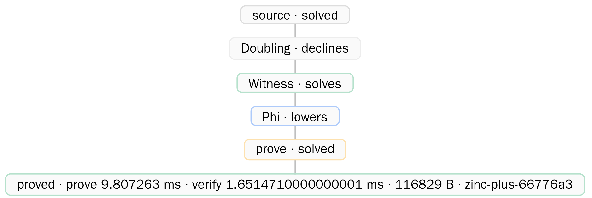
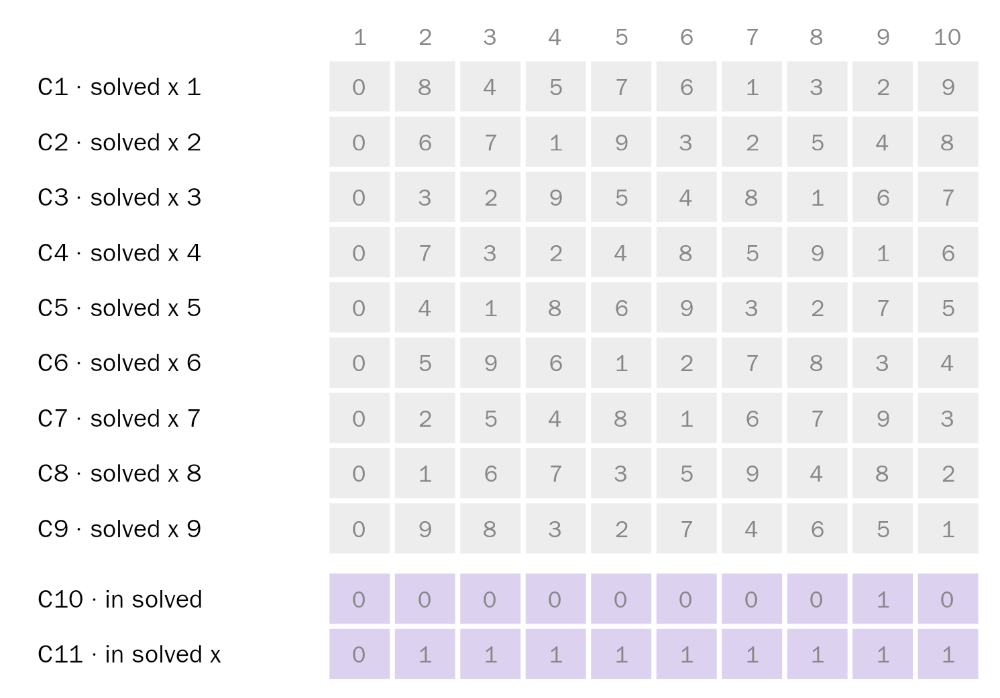
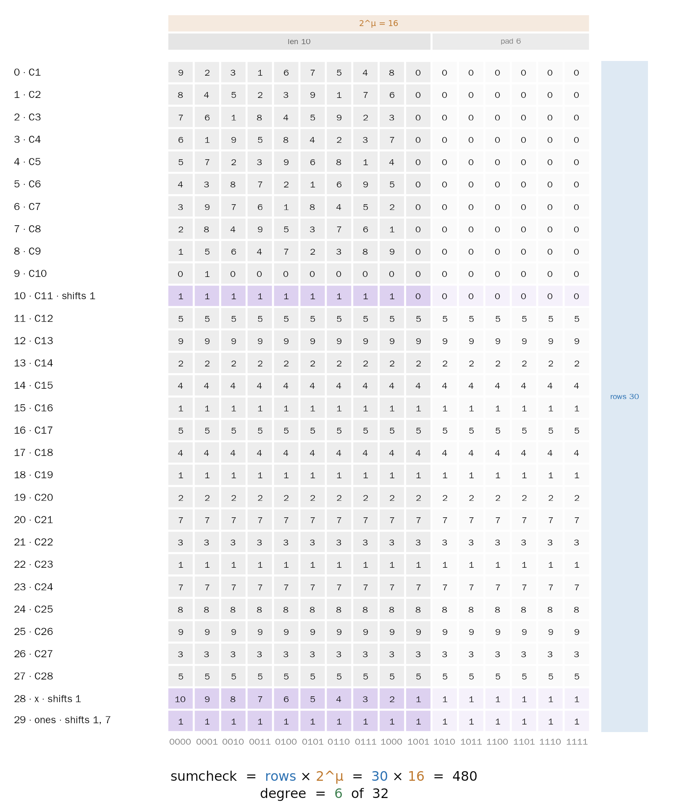
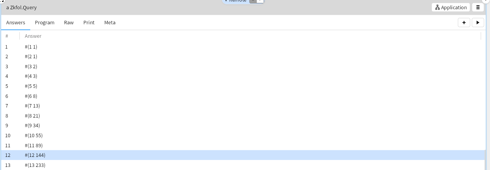

* zkFOL

This is a concrete implementation of the arithmetisation of FOL
validity over finite models on integers proposed by Gabbay and
Mendelsohn in their paper on /"Integer SNARKs for First-Order Logic"/,
as per the draft included in the [[paper/][papers directory]].  This is based on
Gabbay's paper on /"Arithmetisation of computation via polynomial
semantics for first-order logic"/, fulltext available on the
[[https://eprint.iacr.org/2024/954][Cryptology ePrint Archive]].

The arithmetisation of FOL validity over finite models allows the
validity (= the truth) of arbitrarily complex logical assertions over
finite models on integers to be succinctly proved through
cryptographic techniques.  Concretely, this means that a *prover* can
make some assertion about some arrays of whole numbers (just like
sheets in a spreadsheet, but more powerful), and prove validity of
that assertion to a *verifier*, just by sending a short cryptographic
certificate.

As the reader may know, everything from Turing-complete computation to
business compliance logic can be encoded into arrays (spreadsheets) of
integers --- so this is a powerful and expressive paradigm.

Benefits of the FOL approach are efficiency, expressivity, and
susceptibility to powerful compiler optimisation techniques.  Thanks
to these advantages, the prototype in this repository is thousands of
times faster than current state-of-the-art zkVM based techniques, as
per [[https://github.com/mariari/zkvm-fib-bench/blob/main/RESULTS.md][our benchmarks]].  Note that the scales in the benchmarks are
/logarithmic/: every unit represents a 10x speed advantage.

* Benchmarks

The prototype is in its early stages and is improving all the time.
You can check the current speed of the zkFOL prototype in comparison
to existing systems [[https://github.com/mariari/zkvm-fib-bench/blob/main/RESULTS.md][here]].

You can also run the benchmarks yourself: just install as per the
instructions below, and then run the following in IEX (it might take a
minute)

  #+begin_src elixir
    Examples.EBench.report()
  #+end_src

zkFOL is an expressive and user-friendly high-level general-purpose
coding language, with performance which exceeds zkVM approaches by
orders of magnitude /and/ with structure susceptible to efficient
compiler optimisation.  The benchmarks suggest that we can indeed have
the best of all possible worlds: high-level programming, efficient
compilation, and fast execution, all in one logic-based package.

* Examples

** zkFOL is EXPRESSIVE and FAST

*Goal* /Can we write circuits in a way that is both expressive and fast?/

Yes.  zkFOL is expressive, and it is fast.

#+begin_src elixir
  # Found in Examples.ESudoku!

  defmodule Sudoku do
    defrel sudoku(xs, blocks) do
      length(xs, n)
      n = blocks ** 2
      blocks > 0
      each(xs, permutation(n))
      column(xs, cols)
      each(cols, permutation(n))
      boxes(blocks, xs, bs)
      each(bs, permutation(n))
      each(xs, all_labeled)
    end

    defrel boxes(n, rows, bs) do
      map(rows, chunk(n), runs)
      chunk(n, runs, bands)
      map(bands, column, stacks)
      map(stacks, mapcon, grouped)
      concat(grouped, bs)
    end

    defrel mapcon(xs, ys) do
      map(xs, concat, ys)
    end

    defrel all_labeled(xs) do
      each(xs, label)
    end
  end
#+end_src

We just laid out the rules of sudoku, almost directly, with
~permutation(n)~ saying the values are distinct.

Can your expressive language run a 9x9 sudoku this fast? zkFOL was
made with circuits in mind!

** zkFOL can SOLVE

*Goal* /Give an easy way to solve and populate witnesses./

If you are used to imperative programming languages then you might
assume that you would need a separate sudoku /generator/ to live
alongside its sudoku /checker/.  Not with zkFOL.  The logical paradigm
is high-level enough that generating and checking are just two
applications of the same specification; or to put it another way, the
specification /is/ the code.  Watch the same codedebase seamlessly
solve a sudoku puzzle.

#+begin_src elixir
  defrel puzzle(
           1,
           [
             [_, _, _, _, _, _, _, _, _],
             [_, _, _, _, _, 3, _, 8, 5],
             [_, _, 1, _, 2, _, _, _, _],
             [_, _, _, 5, _, 7, _, _, _],
             [_, _, 4, _, _, _, 1, _, _],
             [_, 9, _, _, _, _, _, _, _],
             [5, _, _, _, _, _, _, 7, 3],
             [_, _, 2, _, 1, _, _, _, _],
             [_, _, _, _, 4, _, _, _, 9]
           ]
         )

  defrel solved(x) do
    puzzle(1, x)
    sudoku(x, 3)
  end

  Zkfol.eval!(Examples.ESudoku.solved(), [:_], [])
  |> Zkfol.Query.statement()
  |> Zkfol.compile()
#+end_src

This particular puzzle has a /unique/ solution, however zkFOL can find all solutions.

The found solution here is included almost directly into the witness.
We can see the ~3 _ 8 5~ in column 9.

Here is the actual full witness the system generates for Zinc+:

** zkFOL is TUNED for CIRCUITS

*Goal* /Unleash the true potential of circuits./

Witnesses are matrices.  Thus, in a ZK system the inputs and outputs
have equal status as entries in the witnessing matrix.  In true "logic
programming" style, we are not restricted to forward computation;
backward computation works just as well.  Indeed, zkFOL does not need
to distinguish between the two.

For example:

#+begin_src elixir
  def fib(1) do
    1
  end

  def fib(2) do
    1
  end

  def fib(n) do
    fib(n - 1) + fib(n - 2)
  end
#+end_src

With most systems you can only get the circuit with a known ~n~. But
what if you only know the result of ~fib~ and not the input? zkFOL
lets you generate the witness in whatever way you feel most
comfortable.

#+begin_src elixir
  defmodule Fib do
    use Zkfol.Lang

    defrel fib(1, 1)
    defrel fib(2, 1)

    defrel fib(x, v) do
      x > 2
      fib(x - 1, v1)
      fib(x - 2, v2)
      v = v1 + v2
    end
  end

  # Proving it backwards
  Zkfol.eval!(Fib.fib(), [:_, 55], [])
  |> Zkfol.Query.statement()      # Finds fib(10, 55) for you!
  |> Zkfol.compile()

  # Proving it forwards, same exact witness!

  Zkfol.eval!(Fib.fib(), [10, :_], [])
  |> Zkfol.Query.statement()
  |> Zkfol.compile()

  # Want to have the system find many answers for you!?

  Zkfol.eval!(Examples.EUser.fib(), [:_, :_], [])
#+end_src

Our system lets you find and prove the specific one you want.
zkFOL is a natural fit for solvers!

* Dependencies
- Elixir 1.18 on OTP 27+ :: Consult the installation instructions:
  [[https://elixir-lang.org/install.html][here]].
- Rust :: Consult the installation instructions [[https://www.rust-lang.org/tools/install][here]].
- Glamorous Toolkit :: This is an optional dependency that lets you
  visualize your code and cost performances. Installation instructions
  [[https://gtoolkit.com/start/][here]].

** Step By Step Setup

1. Install Elixir
   - via asdf. Follow the installation guide [[https://asdf-vm.com/guide/getting-started.html][here]], then grab
     the toolchain
     #+begin_src sh
       asdf plugin add erlang
       asdf plugin add elixir
       asdf install erlang 27.3.4
       asdf install elixir 1.18.4
       asdf global erlang 27.3.4
       asdf global elixir 1.18.4
     #+end_src
   - via mise. Follow the installation guide [[https://mise.jdx.dev/][here]], or in short
     #+begin_src sh
       curl https://mise.run | sh
       echo 'eval "$(~/.local/bin/mise activate bash)"' >> ~/.bashrc
       source ~/.bashrc
       mise use -g erlang@27 elixir@1.18
     #+end_src
2. Install Rust via [[https://rustup.rs/][rustup]]
   #+begin_src sh
     curl --proto '=https' --tlsv1.2 -sSf https://sh.rustup.rs | sh
   #+end_src
   If you already have an older Rust, update it instead
   #+begin_src sh
     rustup update stable
     rustup default stable
   #+end_src

3. Build and test

   #+begin_src sh
     mix deps.get
     mix test
   #+end_src

* Known Issues

- If IEX and test refuse to work, it's likely the Mnesia store needs
  to be reset ~rm -rf ./.mnesiastore-<node>/~ (~.mnesiastore-test/~
  for the tests).

* Getting Up and Running

This codebase is an interactive one. Meaning that the best way to
experience your programs is interactively!

** Using IEX

IEX is probably the easiest way to get started.

#+begin_src sh
  iex --sname fol -S mix
#+end_src

This will spawn an interactive shell, where we can do fun things like

#+begin_src elixir
  Zkfol.eval!(Examples.ESudoku.solved(), [:_], []) |> Zkfol.Query.statement() |> Zkfol.compile() |> Zkfol.Log.report()
#+end_src

Here we just solved, proved, and verified a sudoku puzzle. solved
gives the ~sudoku~ predicate a puzzle with 17 clues, for it to figure
out the rest.

For problems that have multiple solutions you can run something like
this

#+begin_src elixir
  ran = Zkfol.compile(Examples.EUser.fib(), args: [8])
  query = Zkfol.eval!(Examples.EUser.fib(), [:_, :_])
  Zkfol.Query.taken(query)           # [[1, 1]]
  Zkfol.Query.next(query)            # {:ok, [2, 1]}

  # no number on statement takes the latest answer
  Zkfol.Query.statement(query) |> Zkfol.compile() |> Zkfol.Log.report()
  # Take the 5th answer
  Zkfol.Query.statement(query, 5) |> Zkfol.compile() |> Zkfol.Log.report()
  Zkfol.Query.next(query) # {:ok, [6, 8]}

  # To close the query
  Zkfol.Query.close(query)
#+end_src

Functions in the ~Zkfol~ module are user facing, and the ~Example~
modules are a good way to get some bearing on the codebase.

A user guide should be coming soon that better explains how it works.

** Using Glamorous Toolkit (GT)

GT is the main way the codebase is developed and offers a lot of
visual guis to everything. However it takes a bit more setup, and
requires you have GT installed.

This section is a WIP, the instructions should be enough for those
willing to try, but a better user guide will come in the future.

To grab the package into GT.
#+begin_src st
  Metacello new
        repository: 'github://zkFOL/zkfol:base/src';
        baseline: #Zkfol;
        load.
#+end_src
- If you are doing active development on the Bridge or AL I suggest
  running the following instead

  #+begin_src st
    Metacello new
      repository: 'github://zkFOL/zkfol:base/src';
      baseline: #Zkfol;
      load: #dev.
  #+end_src

From the shell
#+begin_src sh
  ~/ZKFOL % iex --sname fol -S mix
  iex(fol@YU-NO)7> GtBridge.start_listener(1212)

  14:55:21.253 [debug] starting tcp listener with [host: {0, 0, 0, 0}, port: 1212]
  {:ok, #PID<0.520.0>}

  14:55:21.253 [debug] tcp server on port 1212
#+end_src

Now from GT side evaluate

#+begin_src smalltalk
  BeamLinkApplication stop.
  BeamLinkApplication connectwithServerPort: 1212
#+end_src

Now you are connected.

The above example in IEX can be done more simply now and interactively

#+begin_src elixir
  Zkfol.eval!(Examples.ESudoku.solved(), Examples.ESudoku.act(), [])
  |> Zkfol.Query.statement()
  |> Zkfol.compile()
#+end_src

For example evaluating any of these leads you to a gui that lets you
find more answers

#+begin_src elixir
  # Solve for the second argument
  Zkfol.eval!(Examples.EUser.fib(), [8, :_], [])
  # Solve for the first argument
  Zkfol.eval!(Examples.EUser.fib(), [:_, 21], [])
  # Solve for both arguments!
  Zkfol.eval!(Examples.EUser.fib(), [:_, :_], [])
#+end_src

and then evaluate based on these answers, there are many benefits to
using the GT interface.

* Getting zkFOL in your project

It's quite simple to include zkFOL in your Elixir project.
Just add

#+begin_src elixir
  {:zkfol, git: "https://github.com/zkFOL/zkfol.git"},
#+end_src

to the Elixir projects' dependency.

* Git

This codebase follows a git style similar to [[https://git-scm.com/][git]] or [[https://git.kernel.org/pub/scm/linux/kernel/git/torvalds/linux.git][Linux]].

New code should be based on ~base~, and no attempt to keep it up to
sync with ~master~ should be had. When one's topic is ready, just submit
a PR on github and a maintainer will handle any merge conflicts.

Releases happen every so often, however patches may be slated for a
specific release, so do not be afraid if a maintainer says the PR is
merged but it's still open, this just means that it's merged into
~next~ or ~master~ and will be included in the next scheduled release.

Happy hacking, and don't be afraid to submit patches.
